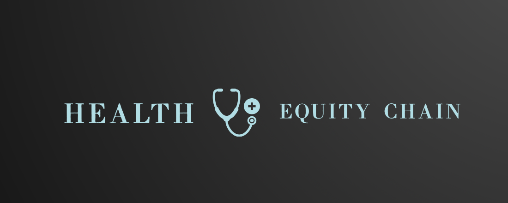

The ambition of HEC is to create a positive feedback loop where improved health outcomes lead to better quality of life and increased economic participation.

Building on an existing network of 500 community-based organizations and reaching 10 million potential beneficiaries, we aim to address critical healthcare accessibility gaps in Kenya, Uganda, and Tanzania. Our solution combines a medical facilities map, secure health records and a medical savings product, in a comprehensive digital ecosystem.

**Background**
There is a pressing need to shift from traditional public funding models to more sustainable, private-sector solutions that leverage the power of community based organizations and digital technology. This shift presents an opportunity to create an integrated digital ecosystem that addresses healthcare challenges comprehensively. By recognizing the interconnectivity between health access, preventive care and community wellbeing, a holistic solution can be developed that not only improves healthcare delivery but also enhances overall community resilience.

Health Equity Chain's partnerships with community based organizations ensure our solution remains grounded in real-world challenges, following an iterative, community-led development and deployment process. This collaborative strategy enables us to address complex healthcare issues holistically and sustainably.


# Publications
TBA

    
```
Scripts are included in the preprocessing folder that may be of use to analysts, that detail imputation and sample size calculation processes, from the initial PROFID study analysis.
